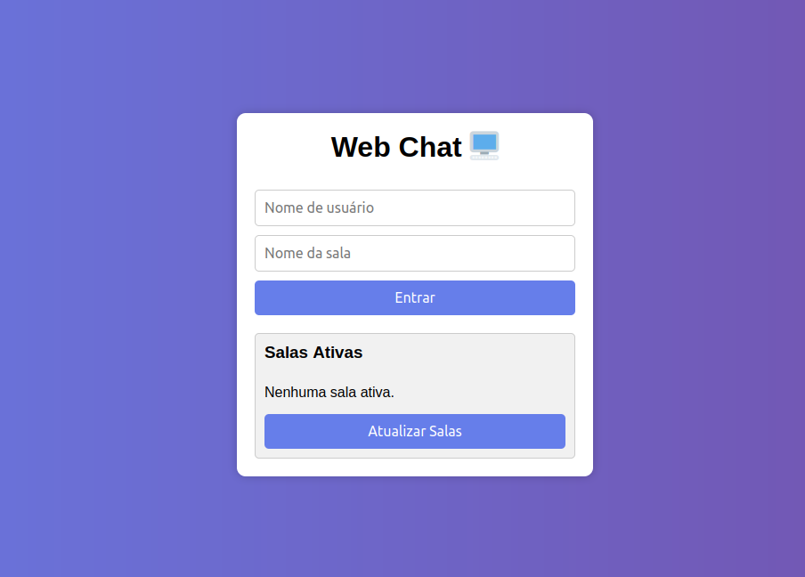

# 🖥️ Chat em Rede Local com Envio de Imagens

Um sistema de chat em tempo real para redes locais para mútliplas salas utilizando de Threading, desenvolvido com **Flask** e **Socket.IO**, que permite envio de mensagens de texto, imagens e listagem de salas ativas.

  

---

## 🚀 Funcionalidades

- **Criar/Entrar em Salas**: Participe de salas com um nome de usuário.
- **Envio de Mensagens com Usuários**: Envio de mensagem com o nome do usuário que a enviou.
- **Envio de Imagens**: Compartilhamento de imagens (PNG, JPG, JPEG, GIF).
- **Download de Imagens**: Baixe as imagens enviadas no chat.
- **Salas Ativas**: Visualize todas as salas com usuários online.

---

## 🛠️ Tecnologias Utilizadas

### **Protocolo de Comunicação**  
- **WebSocket (via Socket.IO)**:   
  - **Funcionamento**:  
    - O handshake inicial é feito via HTTP, seguido pela atualização para WebSocket.  
    - Mantém uma conexão persistente entre cliente e servidor, reduzindo o delay.  

### **Arquitetura Cliente-Servidor**  
- **Gerenciamento de Salas**: Foi usado um dicionário em memória para armazenar a sala e seus usuários. Foi projetado para redes locais pequenas. Exemplo de dicionário : `salas = { "sala1": ["user1", "user2"], ... }`  

### **Transferência de Arquivos (Imagens)**  
- **Upload via HTTP POST**:  
  - Rota `/upload` recebe arquivos e armazena na pasta `uploads`.  
  - **Validação**: Extensões permitidas (`png`, `jpg`, etc.) e padronização de nomes de arquivo (UUID).  
- **Download via HTTP GET**:  
  - Rota `/uploads/<filename>` serve arquivos estáticos.

### Funciona das Biblioteca Flask-SocketIO com Eventlet 
  - **Eventlet**: Biblioteca de I/O assíncrono que permite multiplexação de conexões em uma única thread.  
  - **Funcionamento**:  
    - Cada cliente é tratado como uma corrotina, não bloqueando o servidor durante operações de I/O (ex: envio de mensagens).   
  

###  Testes de Rede Realizados  

1. **Concorrência Máxima**:  
   - 50 clientes conectados em uma sala, enviando mensagens simultâneas.  
   - **Resultado**: Latência média de 120ms  

2. **Transferência de Imagens**:  
   - Arquivo de 2MB enviado em 0.82s (taxa de ~2.5MB/s).  

3. **Recuperação de Falhas**:  
   - Servidor reiniciado: Clientes reconectam automaticamente.  

---


## 📦 Como Executar

### Pré-requisitos
- Python 3.x
- Dependências instaladas via `pip` (veja `requirements.txt`).

### Passo a Passo

1. **Clone o repositório**:
   ```bash
   git clone https://github.com/DavidMarquesss/T2-Redes.git
   cd T2-Redes
   ```

2. **Instale as dependências e crie a pasta uploads**:
   ```bash
   pip install -r requirements.txt
   mkdir uploads
   ```

4. **Inicie o servidor**:
   ```bash
   python server.py
   ```

5. **Acesse o chat**:
   - Abra o navegador em: `http://localhost:5000`.
   - Insira um **nome de usuário** e o **nome da sala**.
   - Clique em **Entrar** e comece a conversar!

---

## 🖼️ Como Usar

1. **Enviar Mensagem de Texto**:
   - Digite a mensagem no campo de texto e pressione **Enter** ou clique em **Enviar**.

2. **Enviar Imagem**:
   - Clique em **Enviar Imagem**, selecione o arquivo e aguarde o upload.

3. **Baixar Imagem**:
   - Clique em **Baixar** abaixo da imagem desejada.

4. **Sair da Sala**:
   - Clique em **Sair** para retornar à tela inicial.

---

## 🔮  Possíveis Melhorias Futuras

- [ ] Salas privadas com senha
- [ ] Upload de arquivos (PDF, DOCX)

---

### Estrutura do Projeto
```
📁 projeto/
├── server.py
├── templates
      └── index.html
├── requirements.txt
├── uploads/          # Armazena imagens enviadas
├── interface-chat.png 
└── README.md
``` 